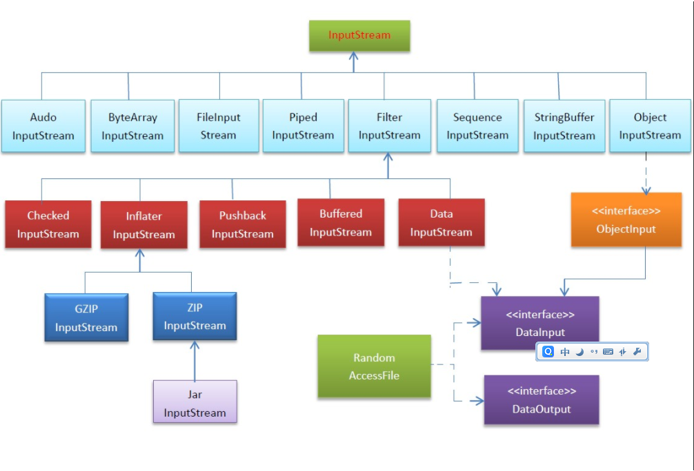

# Java InputStream类
java.io.InputStream类是所有Java IO输入流的基类,它是以字节为单位的输出流。

## 定义
```
public abstract class InputStream  extends Object  implements Closeable
```
此抽象类是表示字节输入流的所有类的超类。需要定义 InputStream 子类的应用程序必须总是提供返回下一个输入字节的方法。
## 类图


- BufferedInputStream： 提供了缓冲功能。 
- DataInputStream: 允许应用程序以与机器无关方式从底层输入流中读取基本 Java 数据类型。应用程序可以使用数据输出流写入稍后由数据输入流读取的数据。 
- PipedInputStream: 允许以管道的方式来处理流。当连接到一个PipedOutputStream后，它会读取后者输出到管道的数据。 
- PushbackInputStream: 允许放回已经读取的数据。 
- SequenceInputStream: 能对多个inputstream进行顺序处理。

## 方法
- InputStream.available() 返回输入流的字节数长度和大小
- InputStream.read() 读取数据流字节，存储到缓冲区数组
- InputStream.close() 关闭输入流并释放与该流关联的所有系统资源
- InputStream.mark(int readlimit) 标记输入流中当前的位置
- InputStream.markSupported() 测试此输入流是否支持mark 和reset 方法
- InputStream.reset() 将此流重新定位到最后一次对此输入流调用 mark 方法时的位置
- InputStream.skip(long n) 跳过和丢弃此输入流中数据的 n 个字节

## 例子
见[IOinTest.java](#)