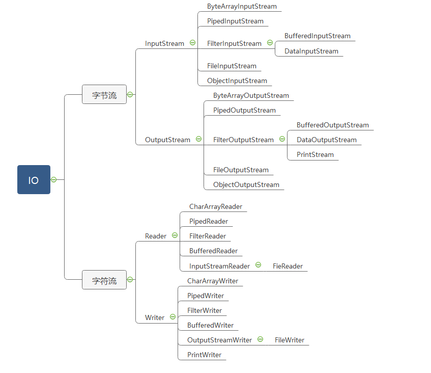

http://www.51gjie.com/java/686.html
#Java IO流详解
流(stream)的概念源于UNIX中管道(pipe)的概念。在UNIX中，管道是一条不间断的字节流，用来实现程序或进程间的通信，或读写外围设备、外部文件等。一个流，必有源端和目的端，它们可以是计算机内存的某些区域，也可以是磁盘文件，甚至可以是Internet上的某个URL。实际上，流的源端和目的端可简单地看成是字节的生产者和消费者，对输入流，可不必关心它的源端是什么，只要简单地从流中读数据，而对输出流，也可不知道它的目的端，只是简单地往流中写数据。

流是一组有顺序的，有起点和终点的字节集合，是对数据传输的总称或抽象。即数据在两设备间的传输称为流，流的本质是数据传输，根据数据传输特性将流抽象为各种类，方便更直观的进行数据操作。 
## 类图结构

