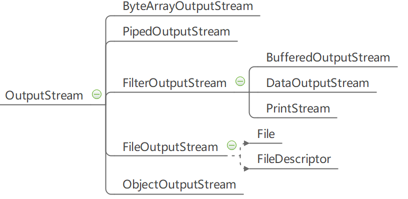

# Java OutputStream类
## 定义
```
public OutputStream()
```
## 方法
- OutputStream.write()将数据写入输出流,准备输出到各种介质
- OutputStream.close()关闭并释放输出流资源
- OutputStream.flush()清空输出流
## 类图

- （1）OutputStream是以字节为单位的输出流的超类，提供了write()函数从输出流中读取字节数据。
- （2）ByteArrayOutputStream是字节数组输出流，写入ByteArrayOutputStream的数据被写入到一个byte数组，缓冲区会随着数据的不断写入而自动增长，可使用toByteArray()和toString()获取数据。
- （3）PipedOutputStream是管道输出流，和PipedInputStream一起使用，能实现多线程间的管道通信。
- （4）FilterOutputStream是过滤输出流，是DataOutputStream，BufferedOutputStream和PrintStream的超类
- （5）DataOutputStream是数据输出流，用来装饰其他的输出流，允许应用程序以与机器无关方式向底层写入基本Java数据类型。
- （6）BufferedOutputStream是缓冲输出流，它的作用是为另一个输出流添加缓冲功能。
- （7）PrintStream是打印输出流，用来装饰其他输出流，为其他输出流添加功能，方便的打印各种数据值
- （8）FileOutputStream是文件输出流，通常用于向文件进行写入操作。
- （9）ObjectOutputStream是对象输出流，它和ObjectInputStream一起对基本数据或者对象的持久存储。
## 例子
```
public static void main(String[] args) {
        File file = new File(FileConstants.FILE_WORK_PATH + File.separator + "1.txt");
        OutputStream out = null;
        try {
            if (!file.exists()) {
                file.createNewFile();
            }
            out = new FileOutputStream(file);
            out.write("测试数据文字".getBytes());

        } catch (IOException e) {
            e.printStackTrace();
        }finally {
            FileConstants.close(out);
        }
    }
```
1. OutputStream类是Java IO API中所有输出流的基类。子类包括BufferedOutputStream，FileOutputStream等等。
2. OutputStream是一个典型的装饰者模式,使用的时候直接new子类。
3. OutputStream可以输出到console，文件，磁盘等目标媒介中。